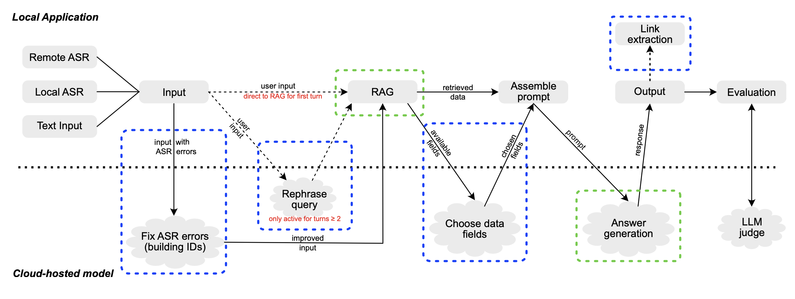

# Campus Plan Bot - Project Plan

This document outlines the high-level vision, architecture, and technical details for the Dialogue Practical project.

## 1. High-Level Vision

The core vision is to develop a sophisticated, multi-turn conversational AI, the "Campus Plan Bot," capable of assisting users with inquiries about the university campus. The system is designed to be robust, handling both text and spoken input, and to provide accurate, concise, and contextually-aware responses.

Development follows an iterative, phased approach. Each phase focuses on implementing and refining specific components based on a rigorous, data-driven evaluation process. The goal for Phase 3 was to substantially improve upon the baseline MVP from Phase 2 by integrating new components for ASR error correction, data filtering, and context-aware query rephrasing, while also enhancing the core RAG pipeline.

## 2. System Architecture & Data Flow

The system is architected as a sequential pipeline that processes user input through several stages to generate a final answer. Components added or updated in Phase 3 are highlighted in the architecture diagram.

[View PDF](docs/phase3/report/data_flow_phase_3.pdf)

### Key Components:

1.  **ASR Fixing:** Identifies and corrects errors in ASR-transcribed input, focusing on numerical building identifiers (e.g., "fifty point thirty-four" -> "50.34"). It uses a dedicated LLM call with few-shot examples to identify errors and their corrections.
2.  **Query Rephrasing:** Enriches user queries in multi-turn conversations with relevant context from the dialogue history. This component is crucial for maintaining context after the `Data Field Selection` step was introduced and is only active for the second turn onwards.
3.  **Query Router:** A new component that classifies user queries as either "simple" or "complex." Simple queries are routed to the RAG, while complex, multi-faceted queries are directed to the Pandas Query Engine.
4.  **RAG (Retrieval-Augmented Generation):** The core retrieval component was significantly improved. It now leverages `LlamaIndex`, enriches the search data with a `name` column, and uses a Cross-Encoder for re-ranking to improve retrieval accuracy.
5.  **Pandas Query Engine (Optional):** This component handles complex queries that require data manipulation and filtering beyond the capabilities of the RAG. It uses an LLM to dynamically generate and execute Pandas code. **Note:** This component currently requires an OpenAI API token to function.
6.  **Data Field Selection:** Filters the documents retrieved by the RAG or Pandas Query Engine to include only the fields necessary to answer the user's specific question. This reduces noise and helps the model generate more concise and relevant answers.
7.  **Answer Generation:** The final LLM call that synthesizes the filtered, retrieved information into a coherent, human-readable response.

## 3. Tech Stack & Tools

- **Language:** Python
- **Core Frameworks:**
  - **LlamaIndex:** Powers the improved RAG component.
  - **Pydantic AI:** Used to create the "LLM-as-a-Judge" for systematic evaluation.
- **Models:**
  - **Core LLM:** Llama 8B model for in-pipeline tasks (ASR fixing, rephrasing, etc.).
  - **Evaluation LLM:** `Qwen3-32B` is used as the powerful "LLM Judge."
  - **Experimental LLMs:** Llama 70B was trialed for more complex prompting tasks.
- **ASR:**
  - Primary: The institute's remote ASR service.
  - Alternative: A local ASR was also used, indicating a flexible architecture.
- **Dependency Management:** `pixi` (`pixi.toml`, `pixi.lock`)

## 4. Constraints & Key Learnings

The project operates under several technical and practical constraints that have shaped the implementation.

- **Model Limitations:** The Llama 8B model, while capable, struggles with complex instructions and language-switching between prompts (English) and data (German). This was mitigated by using highly structured prompts (Markdown, JSON) and providing few-shot examples.
- **Latency vs. Accuracy:** The ASR-fixing component initially introduced a 1.7-second latency due to verbose JSON output. This trade-off was managed by optimizing the output to a concise list format, reducing latency to 0.38s without compromising accuracy.
- **Component Interdependence:** A key lesson was that improving one component can inadvertently harm another (e.g., ASR fixing initially degraded RAG performance). This discovery emphasized the need for both component-specific unit tests and end-to-end evaluation to track overall system health.
- **Evaluation Strategy:** The project relies on an "LLM-as-a-Judge" and a comprehensive, but synthetic, test set. While this allows for systematic and repeatable evaluation, the results may not perfectly mirror real-world user experience. The lack of real user data is a known limitation.
- **Time Constraints:** The project timeline does not permit for a full user beta test or the implementation of all identified future improvements.
